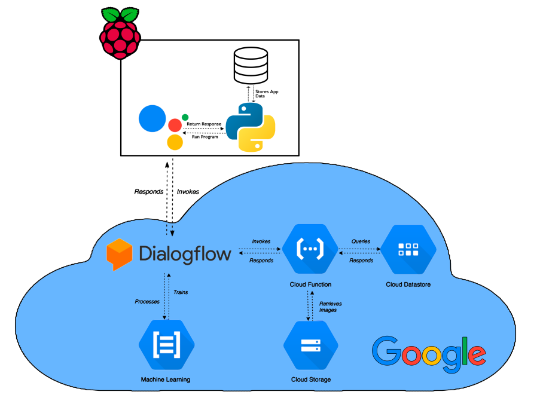
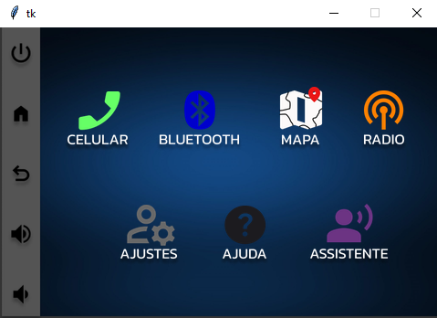
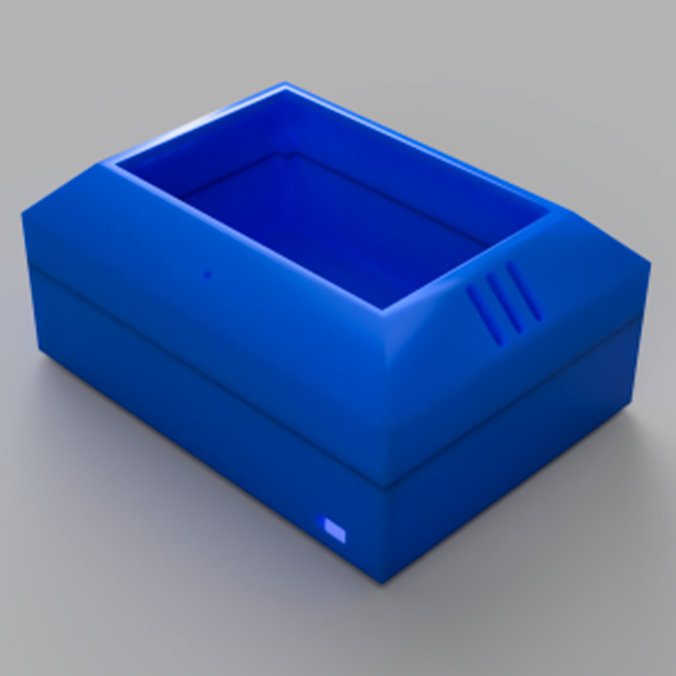

<h1 align="center">
  
   
  Smart Multimedia
</h1>

<h4 align="center">
Smart Multimedia with Python Google Assistant & GUI Integration
</h4>

---
# SprintAPMD
---
## Integrantes
> Bruno Amin, RM 85333

> Carlos Borges, RM 84613

> Eduardo Stefano, RM 84498

> Fábio Pipek, RM 84566

> Marcos Cantelli, RM 84582
---
## Vídeo de apresentação
> [Sprint 4 Advanced Programming Mobile & Dev](https://youtu.be/s4b5S6y8mBo)

---
Execution:
=====

- First install the dependencies:

> pip install -r requirements.txt

---

- Then run the program by executing the following script:

> chmod +x main.sh

> ./main.sh

---

Architecture:
=====
> Raspberry Pi Zero establishes a communication with Google Assistant API and stores any user configuration inside a SQLite Database (Local)
> 
>
---

Electronics & Components:
====
> Electronics Diagram Draft
> 

Demo View & Prototype:
====
> Main Menu
> 
> 

> Assistant working
>
> 

> 3D Modeled Custom Case
>
>  
